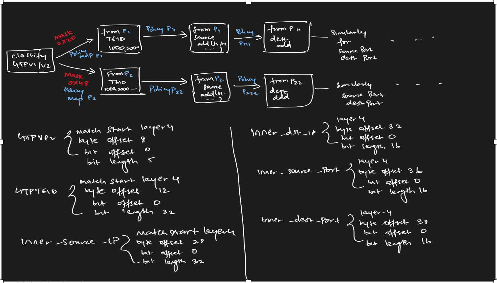

# Firewall filtering GTP-U traffic using Flex filters on Juniper MX routers

As many may know, Juniper's flag ship router, the MX series is immensely flexible. While not only offering the flexibility , it offers great scalability as well. The scale number of firewall filters are great and in case you would want to use a ton of stateless firewalls the TRIO chipset offers the best scale in the market. Talk to your SE for the actual scale.

 In this post, we will be seeing how firewall filters can be used when a particular knob doesnt exist to filter natively. we take GTP packet as an example. Sometimes one may need to filter out a particular GTP packet based on certain fields or inner IP packet for debuggability/analysis purposes. we will consider to filter a packet based on TEID field and the inner IP (v4/v6) to make a decision to accept/reject and then count the packets accordingly. 

In such scenarios when the knobs are not available, one can use flexible filters as an option to create the filter based on hex byte offsets. This is done inline.  

## Configuration of the GTP filter
In order to process the packets we take the below stages 

* Stage1: Classify GTPv1 vs GTPv2 (accept with policy map)
* Stage2: Match previous stage policy on TEID (accept with policy map) 
* Stage3: Match on previous stage policy Inner source IP (accept with policy map)
* Stage4: Match on previous stage policy Inner destination IP (accept)

policy maps are policies which we are used to stamp a value to the result of a filter before it is passed to the next stage. All the filters are then applied in a chain. In this case, 4 filters are created and then created as an input-chain-filter. What this means is `stage1` filter is first executed followed by `stage2` and so on. However the terms within `stage1` will stamp a value based on the policy map. This would be evaluated in the next stage accordingly and would be processed. If the tag(a dummy value 3/6 bit depending on dscp/exp bits used) isn't present those would not be processed. This will ensure all conditions are evaluated before a final decision is made to accept/reject the packet. 

{:class="img-responsive"}

### How flex filter offsets are determined
In the below example, an IPv4 based GTP packet is considered with inner IP being IPv4 

[v4inv4_gtp](../images/v4_in_v4_gtp.png){:class="img-responsive"}

### Configs using Next-term-approach
In the below method, policy maps are not considered. Instead each term is evaluated. Another method is described below using policy maps which is more suitable and scalable when one runs into such use cases.

#### Step1: Create the template
```
set firewall flexible-match GTPVer match-start layer-4
set firewall flexible-match GTPVer byte-offset 8
set firewall flexible-match GTPVer bit-offset 0
set firewall flexible-match GTPVer bit-length 5

set firewall flexible-match GTPTEID match-start layer-4
set firewall flexible-match GTPTEID byte-offset 12
set firewall flexible-match GTPTEID bit-offset 0
set firewall flexible-match GTPTEID bit-length 32

set firewall flexible-match INNER-SRC-IP match-start layer-4
set firewall flexible-match INNER-SRC-IP byte-offset 28
set firewall flexible-match INNER-SRC-IP bit-offset 0
set firewall flexible-match INNER-SRC-IP bit-length 32

set firewall flexible-match INNER-DST-IP match-start layer-4
set firewall flexible-match INNER-DST-IP byte-offset 32
set firewall flexible-match INNER-DST-IP bit-offset 0
set firewall flexible-match INNER-DST-IP bit-length 32

set firewall flexible-match INNER-SRC-PORT match-start layer-4
set firewall flexible-match INNER-SRC-PORT byte-offset 36
set firewall flexible-match INNER-SRC-PORT bit-offset 0
set firewall flexible-match INNER-SRC-PORT bit-length 16

set firewall flexible-match INNER-DST-PORT match-start layer-4
set firewall flexible-match INNER-DST-PORT byte-offset 38
set firewall flexible-match INNER-DST-PORT bit-offset 0
set firewall flexible-match INNER-DST-PORT bit-length 16
```

#### Step2: Create matches based on templates
```
set firewall family inet filter GTP term GTPV1 from protocol udp
set firewall family inet filter GTP term GTPV1 from port 2152
set firewall family inet filter GTP term GTPV1 from port 2123

set firewall family inet filter GTP term GTPV1 from flexible-match-mask mask-in-hex 0xffffffff
set firewall family inet filter GTP term GTPV1 from flexible-match-mask prefix 2908
set firewall family inet filter GTP term GTPV1 from flexible-match-mask flexible-mask-name GTPTEID
set firewall family inet filter GTP term GTPV1 then count TEID-2908
set firewall family inet filter GTP term GTPV1 then next term

set firewall family inet filter GTP term GTPV1-INNER-IP from flexible-match-mask mask-in-hex 0xffffffff
set firewall family inet filter GTP term GTPV1-INNER-IP from flexible-match-mask prefix 0x01010101
set firewall family inet filter GTP term GTPV1-INNER-IP from flexible-match-mask flexible-mask-name INNER-SRC-IP
set firewall family inet filter GTP term GTPV1-INNER-IP then count INNER-SRC-IP-1.1.1.1
set firewall family inet filter GTP term GTPV1-INNER-IP then next term

set firewall family inet filter GTP term GTPV1-INNER-DST-IP from flexible-match-mask mask-in-hex 0xffffffff
set firewall family inet filter GTP term GTPV1-INNER-DST-IP from flexible-match-mask prefix 0x02020202
set firewall family inet filter GTP term GTPV1-INNER-DST-IP from flexible-match-mask flexible-mask-name INNER-DST-IP
set firewall family inet filter GTP term GTPV1-INNER-DST-IP then count INNER-DST-2.2.2.2
set firewall family inet filter GTP term GTPV1-INNER-DST-IP then next term

set firewall family inet filter GTP term GTPV1-INNER-SRC-PORT from flexible-match-mask mask-in-hex 0xffff
set firewall family inet filter GTP term GTPV1-INNER-SRC-PORT from flexible-match-mask prefix 0x03e8
set firewall family inet filter GTP term GTPV1-INNER-SRC-PORT from flexible-match-mask flexible-mask-name INNER-SRC-PORT
set firewall family inet filter GTP term GTPV1-INNER-SRC-PORT then count INNER-SRC-PORT-1000
set firewall family inet filter GTP term GTPV1-INNER-SRC-PORT then next term

set firewall family inet filter GTP term GTPV1-INNER-DST-PORT from flexible-match-mask mask-in-hex 0xffff
set firewall family inet filter GTP term GTPV1-INNER-DST-PORT from flexible-match-mask prefix 0x07d0
set firewall family inet filter GTP term GTPV1-INNER-DST-PORT from flexible-match-mask flexible-mask-name INNER-DST-PORT
set firewall family inet filter GTP term GTPV1-INNER-DST-PORT then count INNER-DST-PORT-2000
set firewall family inet filter GTP term GTPV1-INNER-DST-PORT then accept
```
#### Step3: Apply the filter
```
set interfaces ge-0/0/5 passive-monitor-mode
set interfaces ge-0/0/5 mtu 9000
set interfaces ge-0/0/5 unit 0 family inet filter input GTP
```

### Configs using policy maps
This is the preferred method since it offers scalability and flexibility to handle various combinations such as v4 in v4, v4 in v6, v6 in v6 and v6 in v4 based GTP packets

#### Step1: Define Flex offset templates and Cos markings for policy maps
```
set firewall flexible-match GTPVer match-start layer-4
set firewall flexible-match GTPVer byte-offset 8
set firewall flexible-match GTPVer bit-offset 0
set firewall flexible-match GTPVer bit-length 5
set firewall flexible-match GTPTEID match-start layer-4
set firewall flexible-match GTPTEID byte-offset 12
set firewall flexible-match GTPTEID bit-offset 0
set firewall flexible-match GTPTEID bit-length 32
set firewall flexible-match INNER-SRC-IP match-start layer-4
set firewall flexible-match INNER-SRC-IP byte-offset 28
set firewall flexible-match INNER-SRC-IP bit-offset 0
set firewall flexible-match INNER-SRC-IP bit-length 32
set firewall flexible-match INNER-DST-IP match-start layer-4
set firewall flexible-match INNER-DST-IP byte-offset 32
set firewall flexible-match INNER-DST-IP bit-offset 0
set firewall flexible-match INNER-DST-IP bit-length 32
set firewall flexible-match INNER-SRC-PORT match-start layer-4
set firewall flexible-match INNER-SRC-PORT byte-offset 36
set firewall flexible-match INNER-SRC-PORT bit-offset 0
set firewall flexible-match INNER-SRC-PORT bit-length 16

set firewall flexible-match INNER-DST-PORT match-start layer-4
set firewall flexible-match INNER-DST-PORT byte-offset 38
set firewall flexible-match INNER-DST-PORT bit-offset 0
set firewall flexible-match INNER-DST-PORT bit-length 16

set class-of-service policy-map GTPv1 inet-precedence proto-ip code-point 001
set class-of-service policy-map GTPv2 inet-precedence proto-ip code-point 010
set class-of-service policy-map TEID inet-precedence proto-ip code-point 011
set class-of-service policy-map INNER-SRC inet-precedence proto-ip code-point 100
set class-of-service policy-map INNER-DST inet-precedence proto-ip code-point 101
set class-of-service policy-map INNER-DST-PORT inet-precedence proto-ip code-point 111
set class-of-service policy-map INNER-SRC-PORT inet-precedence proto-ip code-point 110
``` 
#### Step2: Classify GTPv1/v2 
```
set firewall family inet filter gtp-v1-stage1-classify term GTPv1 from protocol udp
set firewall family inet filter gtp-v1-stage1-classify term GTPv1 from port 2152
set firewall family inet filter gtp-v1-stage1-classify term GTPv1 from flexible-match-mask mask-in-hex 0xe0000000
set firewall family inet filter gtp-v1-stage1-classify term GTPv1 from flexible-match-mask prefix 0x30
set firewall family inet filter gtp-v1-stage1-classify term GTPv1 from flexible-match-mask flexible-mask-name GTPVer
set firewall family inet filter gtp-v1-stage1-classify term GTPv1 then policy-map GTPv1
set firewall family inet filter gtp-v1-stage1-classify term GTPv1 then count count-GTPv1
set firewall family inet filter gtp-v1-stage1-classify term GTPv1 then accept
set firewall family inet filter gtp-v1-stage1-classify term GTPv2 from protocol udp
set firewall family inet filter gtp-v1-stage1-classify term GTPv2 from port 2123
set firewall family inet filter gtp-v1-stage1-classify term GTPv2 from flexible-match-mask mask-in-hex 0xf8000000
set firewall family inet filter gtp-v1-stage1-classify term GTPv2 from flexible-match-mask prefix 0x40
set firewall family inet filter gtp-v1-stage1-classify term GTPv2 from flexible-match-mask flexible-mask-name GTPVer
set firewall family inet filter gtp-v1-stage1-classify term GTPv2 then policy-map GTPv2
set firewall family inet filter gtp-v1-stage1-classify term GTPv2 then count count-GTPv2
set firewall family inet filter gtp-v1-stage1-classify term GTPv2 then accept
set firewall family inet filter gtp-v1-stage1-classify term NON-GTP then count NON-GTP-HITS
set firewall family inet filter gtp-v1-stage1-classify term NON-GTP then discard
```
#### Step3: Classify TEID
```
set firewall family inet filter gtp-v1-stage2-filter-teid term 1 from policy-map-except GTPv1
set firewall family inet filter gtp-v1-stage2-filter-teid term 1 then count policy-accept-term1-stage2
set firewall family inet filter gtp-v1-stage2-filter-teid term 1 then accept
set firewall family inet filter gtp-v1-stage2-filter-teid term 1000 from flexible-match-mask mask-in-hex 0xffffffff
set firewall family inet filter gtp-v1-stage2-filter-teid term 1000 from flexible-match-mask prefix 1000
set firewall family inet filter gtp-v1-stage2-filter-teid term 1000 from flexible-match-mask flexible-mask-name GTPTEID
set firewall family inet filter gtp-v1-stage2-filter-teid term 1000 then policy-map TEID
set firewall family inet filter gtp-v1-stage2-filter-teid term 1000 then count count-TEID-1000
set firewall family inet filter gtp-v1-stage2-filter-teid term 1000 then accept
set firewall family inet filter gtp-v1-stage2-filter-teid term 1001 from flexible-match-mask mask-in-hex 0xffffffff
set firewall family inet filter gtp-v1-stage2-filter-teid term 1001 from flexible-match-mask prefix 1001
set firewall family inet filter gtp-v1-stage2-filter-teid term 1001 from flexible-match-mask flexible-mask-name GTPTEID
set firewall family inet filter gtp-v1-stage2-filter-teid term 1001 then policy-map TEID
set firewall family inet filter gtp-v1-stage2-filter-teid term 1001 then count count-TEID-1001
set firewall family inet filter gtp-v1-stage2-filter-teid term 1001 then accept
set firewall family inet filter gtp-v1-stage2-filter-teid term 1002 from flexible-match-mask mask-in-hex 0xffffffff
set firewall family inet filter gtp-v1-stage2-filter-teid term 1002 from flexible-match-mask prefix 1002
set firewall family inet filter gtp-v1-stage2-filter-teid term 1002 from flexible-match-mask flexible-mask-name GTPTEID
set firewall family inet filter gtp-v1-stage2-filter-teid term 1002 then policy-map TEID
set firewall family inet filter gtp-v1-stage2-filter-teid term 1002 then count count-TEID-1002
set firewall family inet filter gtp-v1-stage2-filter-teid term 1002 then accept
set firewall family inet filter gtp-v1-stage2-filter-teid term 1003 from flexible-match-mask mask-in-hex 0xffffffff
set firewall family inet filter gtp-v1-stage2-filter-teid term 1003 from flexible-match-mask prefix 1003
set firewall family inet filter gtp-v1-stage2-filter-teid term 1003 from flexible-match-mask flexible-mask-name GTPTEID
set firewall family inet filter gtp-v1-stage2-filter-teid term 1003 then policy-map TEID
set firewall family inet filter gtp-v1-stage2-filter-teid term 1003 then count count-TEID-1003
set firewall family inet filter gtp-v1-stage2-filter-teid term 1003 then accept
```

#### Step4: handle inner source IP 
```
set firewall family inet filter gtp-v1-stage3-source-filter term 1 from policy-map-except TEID
set firewall family inet filter gtp-v1-stage3-source-filter term 1 then accept
set firewall family inet filter gtp-v1-stage3-source-filter term 1000 from flexible-match-mask mask-in-hex 0xffffffff
set firewall family inet filter gtp-v1-stage3-source-filter term 1000 from flexible-match-mask prefix 0x01010101
set firewall family inet filter gtp-v1-stage3-source-filter term 1000 from flexible-match-mask flexible-mask-name INNER-SRC-IP
set firewall family inet filter gtp-v1-stage3-source-filter term 1000 then policy-map INNER-SRC
set firewall family inet filter gtp-v1-stage3-source-filter term 1000 then count INNER-SRC-COUNT-1.1.1.1
set firewall family inet filter gtp-v1-stage3-source-filter term 1000 then accept
set firewall family inet filter gtp-v1-stage3-source-filter term 1001 from flexible-match-mask mask-in-hex 0xffffffff
set firewall family inet filter gtp-v1-stage3-source-filter term 1001 from flexible-match-mask prefix 0x01010102
set firewall family inet filter gtp-v1-stage3-source-filter term 1001 from flexible-match-mask flexible-mask-name INNER-SRC-IP
set firewall family inet filter gtp-v1-stage3-source-filter term 1001 then policy-map INNER-SRC
set firewall family inet filter gtp-v1-stage3-source-filter term 1001 then count INNER-SRC-COUNT-1.1.1.2
set firewall family inet filter gtp-v1-stage3-source-filter term 1001 then accept
set firewall family inet filter gtp-v1-stage3-source-filter term 1002 from flexible-match-mask mask-in-hex 0xffffffff
set firewall family inet filter gtp-v1-stage3-source-filter term 1002 from flexible-match-mask prefix 0x01010103
set firewall family inet filter gtp-v1-stage3-source-filter term 1002 from flexible-match-mask flexible-mask-name INNER-SRC-IP
set firewall family inet filter gtp-v1-stage3-source-filter term 1002 then policy-map INNER-SRC
set firewall family inet filter gtp-v1-stage3-source-filter term 1002 then count INNER-SRC-COUNT-1.1.1.3
set firewall family inet filter gtp-v1-stage3-source-filter term 1002 then accept
set firewall family inet filter gtp-v1-stage3-source-filter term 1003 from flexible-match-mask mask-in-hex 0xffffffff
set firewall family inet filter gtp-v1-stage3-source-filter term 1003 from flexible-match-mask prefix 0x01010104
set firewall family inet filter gtp-v1-stage3-source-filter term 1003 from flexible-match-mask flexible-mask-name INNER-SRC-IP
set firewall family inet filter gtp-v1-stage3-source-filter term 1003 then policy-map INNER-SRC
set firewall family inet filter gtp-v1-stage3-source-filter term 1003 then count INNER-SRC-COUNT-1.1.1.4
set firewall family inet filter gtp-v1-stage3-source-filter term 1003 then accept
```

#### Step5: Handle inner destIp
```
set firewall family inet filter gtp-v1-stage4-dest-filter term 1 then accept
set firewall family inet filter gtp-v1-stage4-dest-filter term 1000 from flexible-match-mask mask-in-hex 0xffffffff
set firewall family inet filter gtp-v1-stage4-dest-filter term 1000 from flexible-match-mask prefix 0x02010101
set firewall family inet filter gtp-v1-stage4-dest-filter term 1000 from flexible-match-mask flexible-mask-name INNER-DST-IP
set firewall family inet filter gtp-v1-stage4-dest-filter term 1000 then policy-map INNER-SRC-PORT
set firewall family inet filter gtp-v1-stage4-dest-filter term 1000 then count INNER-DST-COUNT-2.1.1.1
set firewall family inet filter gtp-v1-stage4-dest-filter term 1000 then accept
set firewall family inet filter gtp-v1-stage4-dest-filter term 1001 from flexible-match-mask mask-in-hex 0xffffffff
set firewall family inet filter gtp-v1-stage4-dest-filter term 1001 from flexible-match-mask prefix 0x02010102
set firewall family inet filter gtp-v1-stage4-dest-filter term 1001 from flexible-match-mask flexible-mask-name INNER-DST-IP
set firewall family inet filter gtp-v1-stage4-dest-filter term 1001 then policy-map INNER-SRC-PORT
set firewall family inet filter gtp-v1-stage4-dest-filter term 1001 then count INNER-DST-COUNT-2.1.1.2
set firewall family inet filter gtp-v1-stage4-dest-filter term 1001 then accept
set firewall family inet filter gtp-v1-stage4-dest-filter term 1002 from flexible-match-mask mask-in-hex 0xffffffff
set firewall family inet filter gtp-v1-stage4-dest-filter term 1002 from flexible-match-mask prefix 0x02010103
set firewall family inet filter gtp-v1-stage4-dest-filter term 1002 from flexible-match-mask flexible-mask-name INNER-DST-IP
set firewall family inet filter gtp-v1-stage4-dest-filter term 1002 then policy-map INNER-SRC-PORT
set firewall family inet filter gtp-v1-stage4-dest-filter term 1002 then count INNER-DST-COUNT-2.1.1.3
set firewall family inet filter gtp-v1-stage4-dest-filter term 1002 then accept
set firewall family inet filter gtp-v1-stage4-dest-filter term 1003 from flexible-match-mask mask-in-hex 0xffffffff
set firewall family inet filter gtp-v1-stage4-dest-filter term 1003 from flexible-match-mask prefix 0x02010104
set firewall family inet filter gtp-v1-stage4-dest-filter term 1003 from flexible-match-mask flexible-mask-name INNER-DST-IP
set firewall family inet filter gtp-v1-stage4-dest-filter term 1003 then policy-map INNER-SRC-PORT
set firewall family inet filter gtp-v1-stage4-dest-filter term 1003 then count INNER-DST-COUNT-2.1.1.4
set firewall family inet filter gtp-v1-stage4-dest-filter term 1003 then accept
```

#### Step6: Apply the chain filter on the interface 

```
set interfaces ge-0/0/5 mtu 9000
set interfaces ge-0/0/5 unit 0 family inet filter input-chain gtp-v1-stage1-classify
set interfaces ge-0/0/5 unit 0 family inet filter input-chain gtp-v1-stage2-filter-teid
set interfaces ge-0/0/5 unit 0 family inet filter input-chain gtp-v1-stage3-source-filter
set interfaces ge-0/0/5 unit 0 family inet filter input-chain gtp-v1-stage4-dest-filter
```

If one needs to configure interface in `promiscuous mode`, then enable the `passive-monitor-mode` knob using
```
set interfaces ge-0/0/5 passive-monitor-mode
```
Similarly add stage5 and stage 6  as gtp-v1-stage5-source-port and gtp-v1-stage6-dest-port to filter further based on ports. Use the below script to generate scaled configs to test on your router. you can download from [here](https://github.com/ARD92/Scapy-Gtp-packet-examples)  

### outputs
```
root@vmx2# run show firewall

Filter: __default_bpdu_filter__

Filter: gtp-v1-stage1-classify
Counters:
Name                                                Bytes              Packets
NON-GTP-HITS                                            0                    0
count-GTPv1                                          2560                   40
count-GTPv2                                             0                    0

Filter: gtp-v1-stage2-filter-teid
Counters:
Name                                                Bytes              Packets
count-TEID-1000                                       640                   10
count-TEID-1001                                       640                   10
count-TEID-1002                                       640                   10
count-TEID-1003                                       640                   10

Filter: gtp-v1-stage3-source-filter
Counters:
Name                                                Bytes              Packets
INNER-SRC-COUNT-1.1.1.1                               640                   10
INNER-SRC-COUNT-1.1.1.2                               640                   10
INNER-SRC-COUNT-1.1.1.3                               640                   10
INNER-SRC-COUNT-1.1.1.4                               640                   10

Filter: gtp-v1-stage4-dest-filter
Counters:
Name                                                Bytes              Packets
INNER-DST-COUNT-2.1.1.1                               640                   10
INNER-DST-COUNT-2.1.1.2                               640                   10
INNER-DST-COUNT-2.1.1.3                               640                   10
INNER-DST-COUNT-2.1.1.4                               640                   10
```
