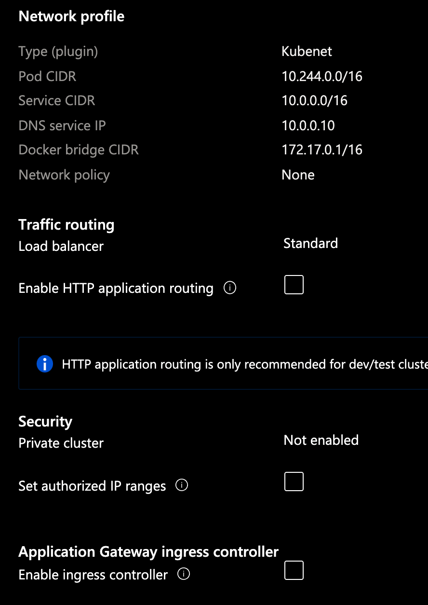
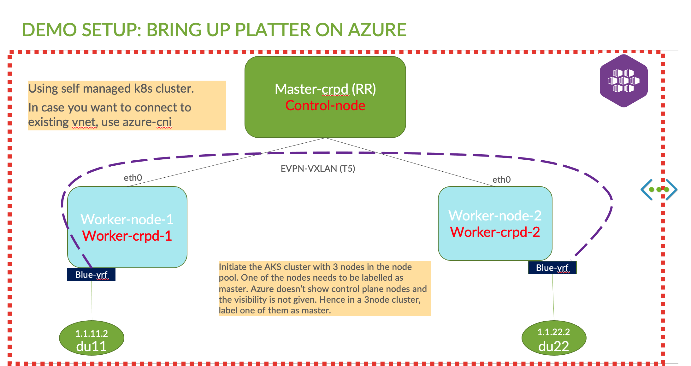

# Azure Kubernetes Services
Azure offers to run applications on k8s which is managed by Azure. It is a hosted kuberenetes service. The kubernetes master/control nodes are controlled by azure and would not be seen to the user.  only the worker nodes will be seen. i.e. the nodes attached to the cluster. There are 2 CNIs which one can leverage. use azure managed CNI which would allow one to connect to existing vnet. Or the second, which is self managed. This uses kubenet a very simple CNI which azure uses. This creates crb0 interface. Azure also supports multus which will be used in the later part of this document to demonstrate Juniper Cloud Native Router (JCNR) 

more information on AKS can be found [here](https://docs.microsoft.com/en-in/azure/aks/)

## Try it! 
using az cli run the below . Or use the below terraform resource to bring up one.

```
az group create --name platter --location eastus
```

### Deploy the cluster 
```
az aks create --resource-group platter --name platter --node-count 2 --enable-addons monitoring --generate-ssh-keys
```
The above command never worked.Received the below error. Alternatively use the portal to deploy. This is due to AD access not given to my account type. it should be type contributor. Because of this a service principle also wasn't allowed to be created as well. 

```
Directory permission is needed for the current user to register the application. For how to configure, please refer 'https://docs.microsoft.com/azure/azure-resource-manager/resource-group-create-service-principal-portal'. Original error: Insufficient privileges to complete the operation.  
```
** Looks more of a permission issue. Nevertheless lets proceed creating the cluster from azure portal ** 

### Get the credentials 
```
az aks get-credentials --resource-group platter --name platter

Merged "platter" as current context in /Users/aprabh/.kube/config
```
### Check the node status

#### Check Nodes
```
kubectl get nodes
NAME                                STATUS   ROLES   AGE     VERSION
aks-agentpool-17023631-vmss000000   Ready    agent   5m40s   v1.19.11
aks-agentpool-17023631-vmss000001   Ready    agent   5m49s   v1.19.11
aks-agentpool-17023631-vmss000002   Ready    agent   5m46s   v1.19.11
```
#### Get all pods 
```
kubectl get pods --all-namespaces
NAMESPACE     NAME                                  READY   STATUS    RESTARTS   AGE
kube-system   azure-ip-masq-agent-6j7gw             1/1     Running   0          2m36s
kube-system   azure-ip-masq-agent-g5dn5             1/1     Running   0          2m30s
kube-system   azure-ip-masq-agent-vsgxr             1/1     Running   0          2m39s
kube-system   coredns-76c97c8599-hq4h7              1/1     Running   0          3m4s
kube-system   coredns-76c97c8599-j2g2h              1/1     Running   0          2m29s
kube-system   coredns-autoscaler-599949fd86-7ddb9   1/1     Running   0          2m59s
kube-system   kube-proxy-5x8w8                      1/1     Running   0          2m39s
kube-system   kube-proxy-pmdpk                      1/1     Running   0          2m30s
kube-system   kube-proxy-z8pzx                      1/1     Running   0          2m36s
kube-system   metrics-server-77c8679d7d-vnsc2       1/1     Running   0          3m4s
kube-system   omsagent-7kk88                        1/1     Running   0          2m36s
kube-system   omsagent-ng276                        1/1     Running   0          2m39s
kube-system   omsagent-pgzqk                        1/1     Running   0          2m30s
kube-system   omsagent-rs-74dd9bfc7d-476cn          1/1     Running   0          3m4s
kube-system   tunnelfront-b6d977874-lg7sd           1/1     Running   0          2m58s
```


## Setup Platter



### Install Multus

Multus is needed to use platter as a secondary CNI. 
```
git clone https://github.com/intel/multus-cni.git && cd multus-cni
cat ./images/multus-daemonset.yml | kubectl apply -f -
```

### Login to AKS nodes

```
kubectl get nodes  -o wide
NAME                                STATUS   ROLES   AGE   VERSION    INTERNAL-IP   EXTERNAL-IP   OS-IMAGE             KERNEL-VERSION     CONTAINER-RUNTIME
aks-agentpool-17023631-vmss000000   Ready    agent   30m   v1.19.11   10.240.0.4    <none>        Ubuntu 18.04.5 LTS   5.4.0-1051-azure   containerd://1.4.4+azure
aks-agentpool-17023631-vmss000002   Ready    agent   30m   v1.19.11   10.240.0.6    <none>        Ubuntu 18.04.5 LTS   5.4.0-1051-azure   containerd://1.4.4+azure
```
#### Create debug container 

```
aravind@Azure:~$ kubectl debug node/aks-agentpool-17023631-vmss000000 -it --image=mcr.microsoft.com/aks/fundamental/base-ubuntu:v0.0.11
Creating debugging pod node-debugger-aks-agentpool-17023631-vmss000000-86qrs with container debugger on node aks-agentpool-17023631-vmss000000.
If you don't see a command prompt, try pressing enter.
root@aks-agentpool-17023631-vmss000000:/#
```

## Create a container registry 

Create a registry so that we can upload all crpd and platter images 

```
az acr create --resource-group platter --name platter --sku Basic
```

Once the registry is created, login using the below

```
az acr login --name platter
```

### Tag the containers 

Find the registry name from the path "Dashboard >> container registry >> overview " and look at the "login server" field. In this example, this would be "platter.azureacr.io"

```
docker tag platter:latest platter.azurecr.io/platter:latest
docker tag crpd:latest platter.azurecr.io/crpd:latest 
```
### Push the containers

push the containers to the registry

```
docker push platter.azurecr.io/platter:latest
docker push platter.azurecr.io/crpd:latest
```

Generally if the ACR isn't linked to the k8s cluster, then there would be an image pull error. To solve this, we need to link the ACR to the K8s cluster using the below 

```
az aks update -n platter -g platter --attach-acr platter
```
once it updates, the image would be pulled successfully.

### Label nodes accordingly 
The nodes when comes up on AKS, wont be tagged. So the master cRPD node may not be seen. You would see something like below 

```
root@compute21:~/platter/share# kubectl get pods -n kube-system
NAME                                  READY   STATUS                  RESTARTS   AGE
azure-ip-masq-agent-vd2bw             1/1     Running                 0          13m
azure-ip-masq-agent-x84fh             1/1     Running                 0          14m
coredns-76c97c8599-hq4h7              1/1     Running                 0          27h
coredns-76c97c8599-j2g2h              1/1     Running                 0          27h
coredns-autoscaler-599949fd86-7ddb9   1/1     Running                 0          27h
kube-crpd-worker-ds-n2jkr             0/1     Init:CrashLoopBackOff   5          4m45s
kube-crpd-worker-ds-vgrp4             0/1     Init:CrashLoopBackOff   5          4m31s
kube-multus-ds-jvzcm                  1/1     Running                 0          27h
kube-multus-ds-nhpw4                  1/1     Running                 0          27h
kube-proxy-pmdpk                      1/1     Running                 0          27h
kube-proxy-z8pzx                      1/1     Running                 0          27h
metrics-server-77c8679d7d-vnsc2       1/1     Running                 0          27h
omsagent-5dqn2                        1/1     Running                 0          13m
omsagent-rs-64bf4cddd8-9zvn4          1/1     Running                 0          14m
omsagent-xrr9x                        1/1     Running                 0          13m
tunnelfront-7b57b57d85-gwmr9          1/1     Running                 0          14m
```
Notice that no cRPD master is present. only 2 worker nodes are present. From the daemon set we can see there is one master and one worker node DS. So tag the node as master 
The above crashloopbackoff error was due to the below reason.
```
time="2021-07-27T14:06:52Z" level=error msg="Failed to find node config file /host/var/etc/platter/node-aks-agentpool-17023631-vmss000000.json"
time="2021-07-27T14:08:22Z" level=info msg="Reading NodeNetConfFile:  /host/var/etc/platter/node-aks-agentpool-17023631-vmss000000.json"
time="2021-07-27T14:08:22Z" level=error msg="Failed to find node config file /host/var/etc/platter/node-aks-agentpool-17023631-vmss000000.json"
```
The error was fixed recompiling the latest platter version.  

```
root@compute21:~/platter/share# kubectl get ds -n kube-system
NAME                  DESIRED   CURRENT   READY   UP-TO-DATE   AVAILABLE   NODE SELECTOR                 AGE
azure-ip-masq-agent   2         2         2       2            2           beta.kubernetes.io/os=linux   28h
kube-crpd-master-ds   0         0         0       0            0           <none>                        44m
kube-crpd-worker-ds   2         2         0       2            0           <none>                        44m
kube-multus-ds        2         2         2       2            2           <none>                        27h
kube-proxy            2         2         2       2            2           beta.kubernetes.io/os=linux   28h
omsagent              2         2         2       2            2           <none>                        28h
omsagent-win          0         0         0       0            0           <none>                        28h
```

#### Show the labels on the nodes 
```
root@compute21:~/platter/share# kubectl get nodes --show-labels
NAME                                STATUS   ROLES   AGE   VERSION    LABELS
aks-agentpool-17023631-vmss000000   Ready    agent   28h   v1.19.11   agentpool=agentpool,beta.kubernetes.io/arch=amd64,beta.kubernetes.io/instance-type=Standard_DS2_v2,beta.kubernetes.io/os=linux,failure-domain.beta.kubernetes.io/region=eastus,failure-domain.beta.kubernetes.io/zone=eastus-1,kubernetes.azure.com/cluster=MC_platter_platter_eastus,kubernetes.azure.com/mode=system,kubernetes.azure.com/node-image-version=AKSUbuntu-1804gen2containerd-2021.07.03,kubernetes.azure.com/os-sku=Ubuntu,kubernetes.azure.com/role=agent,kubernetes.io/arch=amd64,kubernetes.io/hostname=aks-agentpool-17023631-vmss000000,kubernetes.io/os=linux,kubernetes.io/role=agent,node-role.kubernetes.io/agent=,node.kubernetes.io/instance-type=Standard_DS2_v2,storageprofile=managed,storagetier=Premium_LRS,topology.kubernetes.io/region=eastus,topology.kubernetes.io/zone=eastus-1
aks-agentpool-17023631-vmss000002   Ready    agent   28h   v1.19.11   agentpool=agentpool,beta.kubernetes.io/arch=amd64,beta.kubernetes.io/instance-type=Standard_DS2_v2,beta.kubernetes.io/os=linux,failure-domain.beta.kubernetes.io/region=eastus,failure-domain.beta.kubernetes.io/zone=eastus-3,kubernetes.azure.com/cluster=MC_platter_platter_eastus,kubernetes.azure.com/mode=system,kubernetes.azure.com/node-image-version=AKSUbuntu-1804gen2containerd-2021.07.03,kubernetes.azure.com/os-sku=Ubuntu,kubernetes.azure.com/role=agent,kubernetes.io/arch=amd64,kubernetes.io/hostname=aks-agentpool-17023631-vmss000002,kubernetes.io/os=linux,kubernetes.io/role=agent,node-role.kubernetes.io/agent=,node.kubernetes.io/instance-type=Standard_DS2_v2,storageprofile=managed,storagetier=Premium_LRS,topology.kubernetes.io/region=eastus,topology.kubernetes.io/zone=eastus-3
root@compute21:~/platter/share#
``` 

#### Label the node 
Let us label one of the nodes as master. 

```
kubectl label nodes aks-agentpool-17023631-vmss000000 hostname=master
kubectl label nodes aks-agentpool-17023631-vmss000000 node-role.kubernetes.io/master=true
```
Once the labelling has been done, load the files to bring up platter 

```
kubectl apply -f platter-secrets.yaml
kubectl apply -f platter-node-config.yaml
kubectl apply -f platter-config.yaml
kubectl apply -f platter.yaml
```

##### Verify Status
```
kubectl get pods -n kube-system

NAME                                  READY   STATUS    RESTARTS   AGE
azure-ip-masq-agent-vd2bw             1/1     Running   0          4h51m
azure-ip-masq-agent-x84fh             1/1     Running   0          4h51m
coredns-76c97c8599-hq4h7              1/1     Running   0          32h
coredns-76c97c8599-j2g2h              1/1     Running   0          32h
coredns-autoscaler-599949fd86-7ddb9   1/1     Running   0          32h
kube-crpd-master-ds-wp74k             1/1     Running   0          18m
kube-crpd-worker-ds-hsmbm             1/1     Running   0          18m
kube-multus-ds-jvzcm                  1/1     Running   0          32h
kube-multus-ds-nhpw4                  1/1     Running   0          32h
kube-proxy-pmdpk                      1/1     Running   0          32h
kube-proxy-z8pzx                      1/1     Running   0          32h
metrics-server-77c8679d7d-vnsc2       1/1     Running   0          32h
omsagent-5dqn2                        1/1     Running   0          4h51m
omsagent-rs-64bf4cddd8-9zvn4          1/1     Running   0          4h51m
omsagent-xrr9x                        1/1     Running   0          4h51m
tunnelfront-7b57b57d85-gwmr9          1/1     Running   0          4h51m
```

#### Add the application pods on the worker nodes accordingly 

```
kubectl apply -f ubuntu-du11.yml
kubectl apply -f ubuntu-du22.yml
```

You might see the below error when multus tries to attach the network interface. Platter uses kubelet.conf and that has to be referrenced in the pods created. 

##### Error seen during net attach 

```
Kubelet.conf missing.. Need to regenerate the exact error and update the field 
```
the kubelet.conf should be copied to all the worker nodes where the network attachment would be made. The only way to copy files into azure nodes is by starting a debug container.
the config file is created locally when the AKS cluster is connected . The file would be present under ~/.kube/config 

```
kubectl cp config node-debugger-aks-agentpool-23733201-vmss000001-htpvf:/host/etc/kubernetes/kubelet.conf
kubectl cp config node-debugger-aks-agentpool-23733201-vmss000002-vlwwn:/host/etc/kubernetes/kubelet.conf
```
Once the above is done, the pods will transition to running state 

```
kubectl get pods
NAME                                                    READY   STATUS      RESTARTS   AGE
ubuntu-du11                                             1/1     Running     0          70m
ubuntu-du22                                             1/1     Running     0          69m
```

#### Verify kernel modules in Azure 
AKS clusters use a VMSS (VM scale set) to bring up the nodes. You can autoscale up or manually scale up accordinlgy based on requirements. These linux distros are customized with not many modules present.

```
root@aks-agentpool-23733201-vmss000002:/host/sbin# uname -a
Linux aks-agentpool-23733201-vmss000002 5.4.0-1051-azure #53~18.04.1-Ubuntu SMP Fri Jun 18 22:32:58 UTC 2021 x86_64 x86_64 x86_64 GNU/Linux
```
Commands such as lsmod may not work. In order to get that working follow the below steps
```
root@aks-agentpool-23733201-vmss000002:/host/sbin# /host/sbin/lsmod | grep vxlan
bash: /host/sbin/lsmod: No such file or directory
``` 

1. launch a debug container 
    ```
    kubectl debug node/aks-agentpool-17023631-vmss000000 -it --image=mcr.microsoft.com/aks/fundamental/base-ubuntu:v0.0.11
    ```
2. Navigate to /host/sbin
    ```
    cd /host/sbin

    root@aks-agentpool-23733201-vmss000002:/host/sbin# ls -l lsmod
    lrwxrwxrwx 1 root root 9 Jul 28  2020 lsmod -> /bin/kmod
    ```
3. Copy the lsmod file from /host/bin/kmod which is a sym link to /sbin/lsmod  
    ```
    root@aks-agentpool-23733201-vmss000002:/host/sbin# cp /host/bin/kmod /sbin/lsmod
    root@aks-agentpool-23733201-vmss000002:/host/sbin# lsmod
    ```

At this time you would be able to run lsmod 

```
root@aks-agentpool-23733201-vmss000002:/host/sbin# lsmod
Module                  Size  Used by
vrf                    28672  0
nf_tables             143360  0
dummy                  16384  0
ipip                   20480  0
ip6_tunnel             40960  0
tunnel6                16384  1 ip6_tunnel
sit                    32768  0
tunnel4                16384  2 ipip,sit
ip_gre                 28672  0
gre                    16384  1 ip_gre
xt_statistic           16384  2
nf_conntrack_netlink    45056  0
nfnetlink              16384  6 nf_conntrack_netlink,nf_tables
xt_nat                 16384  7
ipt_REJECT             16384  0
nf_reject_ipv4         16384  1 ipt_REJECT
xt_addrtype            16384  2
ebt_ip                 16384  2
veth                   28672  0
< ------------ Snipped -------------------- >
```
##### Verify if VXLAN module is loaded 

We notice that vxlan modules are not seen 
```
root@aks-agentpool-23733201-vmss000002:/host/sbin# lsmod | grep vxlan
```

Although the above doesnt show the module, VXLAN packets are seen. The only module I was able to find was the below 

```
cd /lib/modules/
cd 5.4.0-1051-azure/
lrwxrwxrwx 1 root root 39 Jun 18 21:36 build -> /usr/src/linux-headers-5.4.0-1051-azure
root@aks-agentpool-23733201-vmss000002:/lib/modules/5.4.0-1051-azure# find . | grep vxlan
./kernel/net/openvswitch/vport-vxlan.ko
```
Try loading the modules 
```
modprobe vxlan
```

the above doesnt error but also doesnt not display the module loaded on lsmod too!! need to check with azure folks! 

#### Test Traffic between the 2 pods attached to the worker nodes 
In order for traffic to pass through, certain IpTable rules are to be added to both the worker nodes where the pods are attached to. These IP table rules cannot be added to debug container as it does not give permission to make changes.
The debug container also does not support privileged mode. It is opened for enhancement but not merged. For more information check [here](https://github.com/kubernetes/kubectl/issues/1051)

as an alternative option, load IPtables program on cRPD worker nodes 

```
apt-get update
apt-get install iptables -y 
```
Once the Iptables program is installed add the below . The Nat rules need to be edited accordingly depending on the IP address range utilized 

```
iptables -I KUBE-FORWARD -j ACCEPT
iptables -t nat -I POSTROUTING -s 1.1.0.0/16 -d 1.1.0.0/16 -j ACCEPT
iptables -t nat -I PREROUTING -s 1.1.0.0/16 -d 1.1.0.0/16 -j ACCEPT
```

##### Verify route tables on worker nodes 

```
root@aks-agentpool-23733201-vmss000002> show bgp summary
Threading mode: BGP I/O
Default eBGP mode: advertise - accept, receive - accept
Groups: 1 Peers: 1 Down peers: 0
Table          Tot Paths  Act Paths Suppressed    History Damp State    Pending
bgp.l3vpn.0
                       0          0          0          0          0          0
bgp.l3vpn-inet6.0
                       0          0          0          0          0          0
bgp.evpn.0
                       2          2          0          0          0          0
Peer                     AS      InPkt     OutPkt    OutQ   Flaps Last Up/Dwn State|#Active/Received/Accepted/Damped...
10.240.0.4            64512        402        403       0       0     2:54:25 Establ
  bgp.l3vpn.0: 0/0/0/0
  bgp.l3vpn-inet6.0: 0/0/0/0
  bgp.evpn.0: 2/2/2/0
  blue.evpn.0: 2/2/2/0
```

Check EVPN routes

```
root@aks-agentpool-23733201-vmss000002> show route table blue.evpn.0

blue.evpn.0: 4 destinations, 4 routes (4 active, 0 holddown, 0 hidden)
+ = Active Route, - = Last Active, * = Both

5:10.240.0.5:1::0::1.1.11.0::30/248
                   *[BGP/170] 01:38:47, localpref 100, from 10.240.0.4
                      AS path: I, validation-state: unverified
                    >  to 10.240.0.5 via eth0
5:10.240.0.6:1::0::1.1.22.0::30/248
                   *[EVPN/170] 01:38:48
                       Indirect
5:10.240.0.5:1::0::abcd::101:b00::126/248
                   *[BGP/170] 01:38:47, localpref 100, from 10.240.0.4
                      AS path: I, validation-state: unverified
                    >  to 10.240.0.5 via eth0
5:10.240.0.6:1::0::abcd::101:1600::126/248
                   *[EVPN/170] 01:38:48
                       Indirect
```

Check VXLAN overlay 
```
root@aks-agentpool-23733201-vmss000002> show route table blue.evpn.0 extensive

blue.evpn.0: 4 destinations, 4 routes (4 active, 0 holddown, 0 hidden)
5:10.240.0.5:1::0::1.1.11.0::30/248 (1 entry, 1 announced)
        *BGP    Preference: 170/-101
                Route Distinguisher: 10.240.0.5:1
                Next hop type: Indirect, Next hop index: 0
                Address: 0x562e9f82a0dc
                Next-hop reference count: 4
                Source: 10.240.0.4
                Protocol next hop: 10.240.0.5
                Indirect next hop: 0x2 no-forward INH Session ID: 0x0
                State: <Secondary Active Int Ext>
                Peer AS: 64512
                Age: 1:40:15 	Metric2: 0
                Validation State: unverified
                Task: BGP_64512_64512.10.240.0.4
                Announcement bits (1): 0-blue-EVPN-L3-context
                AS path: I  (Originator)
                Cluster list:  10.240.0.4
                Originator ID: 10.240.0.5
                Communities: target:11:11 encapsulation:vxlan(0x8) router-mac:4e:9b:0e:f2:6e:0e
                Import Accepted
                Route Label: 10002
                Overlay gateway address: 0.0.0.0
                ESI 00:00:00:00:00:00:00:00:00:00
                Localpref: 100
                Router ID: 10.240.0.4
                Primary Routing Table: bgp.evpn.0
                Thread: junos-main
                Indirect next hops: 1
                        Protocol next hop: 10.240.0.5
                        Indirect next hop: 0x2 no-forward INH Session ID: 0x0
                        Indirect path forwarding next hops: 1
                                Next hop type: Router
                                Next hop: 10.240.0.5 via eth0
                                Session Id: 0x0
                                10.240.0.0/16 Originating RIB: inet.0
                                  Node path count: 1
                                  Forwarding nexthops: 1
                                        Next hop type: Interface
                                        Next hop: via eth0

5:10.240.0.6:1::0::1.1.22.0::30/248 (1 entry, 1 announced)
        *EVPN   Preference: 170
                Next hop type: Indirect, Next hop index: 0
                Address: 0x562e9f826adc
                Next-hop reference count: 5
                Protocol next hop: 10.240.0.6
                Indirect next hop: (nil) - INH Session ID: 0x0
                State: <Active Int Ext>
                Age: 1:40:16
                Validation State: unverified
                Task: blue-EVPN-L3-context
                Announcement bits (1): 1-rt-export
                AS path: I
                Communities: encapsulation:vxlan(0x8) router-mac:f6:76:2f:ca:d4:ff
                Route Label: 10002
                Overlay gateway address: 0.0.0.0
                ESI 00:00:00:00:00:00:00:00:00:00
                Thread: junos-main
< ------------- snipped ----------------- >
```

check dataplane encaps by entering shell 

```
# ip route show table 1
1.1.11.0/30  encap ip id 10002 src 10.240.0.6 dst 10.240.0.5 ttl 255 tos 0 via 10.240.0.5 dev irb proto 22 onlink
broadcast 1.1.22.0 dev vethnet1-55eed2 proto kernel scope link src 1.1.22.1
1.1.22.0/30 dev vethnet1-55eed2 proto kernel scope link src 1.1.22.1
local 1.1.22.1 dev vethnet1-55eed2 proto kernel scope host src 1.1.22.1
1.1.22.2 via 1.1.22.2 dev vethnet1-55eed2 proto 22
broadcast 1.1.22.3 dev vethnet1-55eed2 proto kernel scope link src 1.1.22.1
```
Ping from ubuntu-du11 to ubuntu-du22 

```
root@ubuntu-du11:/# ping 1.1.22.2
PING 1.1.22.2 (1.1.22.2) 56(84) bytes of data.
64 bytes from 1.1.22.2: icmp_seq=1 ttl=62 time=1.14 ms
64 bytes from 1.1.22.2: icmp_seq=2 ttl=62 time=0.417 ms
64 bytes from 1.1.22.2: icmp_seq=3 ttl=62 time=0.360 ms
```

tcpdump on worker node 

```
root@aks-agentpool-23733201-vmss000002:/lib/modules/5.4.0-1051-azure# tcpdump -ni eth0 udp dst port 4789
tcpdump: verbose output suppressed, use -v or -vv for full protocol decode
listening on eth0, link-type EN10MB (Ethernet), capture size 262144 bytes
21:05:42.043352 IP 10.240.0.5.33096 > 10.240.0.6.4789: VXLAN, flags [I] (0x08), vni 10002
IP 10.240.0.5 > 1.1.22.2: ICMP echo request, id 301, seq 1, length 64
21:05:43.053319 IP 10.240.0.5.33096 > 10.240.0.6.4789: VXLAN, flags [I] (0x08), vni 10002
IP 10.240.0.5 > 1.1.22.2: ICMP echo request, id 301, seq 2, length 64
21:05:44.077375 IP 10.240.0.5.33096 > 10.240.0.6.4789: VXLAN, flags [I] (0x08), vni 10002
IP 10.240.0.5 > 1.1.22.2: ICMP echo request, id 301, seq 3, length 64
21:05:45.101385 IP 10.240.0.5.33096 > 10.240.0.6.4789: VXLAN, flags [I] (0x08), vni 10002
IP 10.240.0.5 > 1.1.22.2: ICMP echo request, id 301, seq 4, length 64
```
## IP addressing 

```sh
# kubectl get pods -o wide -n kube-system
NAME                                  READY   STATUS    RESTARTS   AGE   IP           NODE                                NOMINATED NODE   READINESS GATES
azure-ip-masq-agent-tsx26             1/1     Running   0          10h   10.240.0.4   aks-agentpool-23733201-vmss000000   <none>           <none>
azure-ip-masq-agent-wdd26             1/1     Running   0          10h   10.240.0.6   aks-agentpool-23733201-vmss000002   <none>           <none>
azure-ip-masq-agent-zz8jv             1/1     Running   0          10h   10.240.0.5   aks-agentpool-23733201-vmss000001   <none>           <none>
coredns-76c97c8599-549hr              1/1     Running   0          10h   10.244.0.3   aks-agentpool-23733201-vmss000002   <none>           <none>
coredns-76c97c8599-zdb2p              1/1     Running   0          10h   10.244.1.6   aks-agentpool-23733201-vmss000001   <none>           <none>
coredns-autoscaler-599949fd86-gxpwg   1/1     Running   0          10h   10.244.1.4   aks-agentpool-23733201-vmss000001   <none>           <none>
kube-crpd-master-ds-gfzqp             1/1     Running   0          10h   10.240.0.4   aks-agentpool-23733201-vmss000000   <none>           <none>
kube-crpd-worker-ds-9p4d6             1/1     Running   0          10h   10.240.0.6   aks-agentpool-23733201-vmss000002   <none>           <none>
kube-crpd-worker-ds-dsd7d             1/1     Running   0          10h   10.240.0.5   aks-agentpool-23733201-vmss000001   <none>           <none>
kube-multus-ds-b7cff                  1/1     Running   0          10h   10.240.0.4   aks-agentpool-23733201-vmss000000   <none>           <none>
kube-multus-ds-dd778                  1/1     Running   0          10h   10.240.0.6   aks-agentpool-23733201-vmss000002   <none>           <none>
kube-multus-ds-zhlnq                  1/1     Running   0          10h   10.240.0.5   aks-agentpool-23733201-vmss000001   <none>           <none>
kube-proxy-f2d8n                      1/1     Running   0          10h   10.240.0.6   aks-agentpool-23733201-vmss000002   <none>           <none>
kube-proxy-kphsf                      1/1     Running   0          10h   10.240.0.4   aks-agentpool-23733201-vmss000000   <none>           <none>
kube-proxy-qbh65                      1/1     Running   0          10h   10.240.0.5   aks-agentpool-23733201-vmss000001   <none>           <none>
metrics-server-77c8679d7d-snlcd       1/1     Running   1          10h   10.244.1.5   aks-agentpool-23733201-vmss000001   <none>           <none>
omsagent-4jg84                        1/1     Running   0          10h   10.244.1.2   aks-agentpool-23733201-vmss000001   <none>           <none>
omsagent-8clf7                        1/1     Running   0          10h   10.244.0.2   aks-agentpool-23733201-vmss000002   <none>           <none>
omsagent-g5kdd                        1/1     Running   0          10h   10.244.2.2   aks-agentpool-23733201-vmss000000   <none>           <none>
omsagent-rs-5b5dd65688-47qbf          1/1     Running   0          10h   10.244.1.7   aks-agentpool-23733201-vmss000001   <none>           <none>
tunnelfront-7b79bdbd99-6kr5v          1/1     Running   0          10h   10.244.1.3   aks-agentpool-23733201-vmss000001   <none>           <none>

# kubectl get pods -o wide
NAME                                                    READY   STATUS      RESTARTS   AGE   IP            NODE                                NOMINATED NODE   READINESS GATES
node-debugger-aks-agentpool-23733201-vmss000002-p4s67   1/1     Running     0          8h    10.240.0.6    aks-agentpool-23733201-vmss000002   <none>           <none>
ubuntu-du11                                             1/1     Running     0          8h    10.244.1.71   aks-agentpool-23733201-vmss000001   <none>           <none>
ubuntu-du22                                             1/1     Running     0          8h    10.244.0.4    aks-agentpool-23733201-vmss000002   <none>           <none>
```
## Debug Tips in azure
- you cannot log into host nodes and make changes 
    - In order to login, you need to create a debug container as described in one of the steps. 
    - Although you would have privileged access, no ip route commands can be run to make changes. For example cannot add lo IP address
- Once you login to the host node, do a "df" to check what is the mount directory 
    - in the above example it was "/host/" which is where "/dev/sda1" was mounted. So that is the directory where all CNI is placed. 
    - In order to debug platter you need to check /host/etc/cni and /host/var/log/platter-cni.log 
- Ensure your config file is copied to all nodes under /etc/kubernetes/kubelet.conf . If not present, your pods will not start, it will be stuck in container creating 
    - you would have to create a debug container and kubectl cp to it. notes in [this section](##### Error seen during net attach)
- Add necessary IPtable rules. In order to add this, you cannot use debug container .Since cRPD runs in host mode, install iptables on cRPD and then add the necessary rules 

## Adding a secondary interface to AKS cluster nodes 
There could be scenario where you would want to run VMwork loads but really route it over JCNR. Since the AKS cluster offers within a single subnet in a vnet and the only way is to rely on eth0 interface , which is the default interface for the cluster to work. We cannot rely on this and would require a secondary interface. The AKS cluster itself runs in a vm scale set (if in an availability zone) or a vm (if no availability zone chosen). This VMSS acts as a host node. So, in order to add a secondary interface, we can stop the VMSS and attach another interface since AKS resource doesnt offer any flexibility to do the same. 

One thing to note is the VMSS should not get an ephemeral data disk. With that, one cannot de-allocate a VM/VMSS . More information available [here](https://docs.microsoft.com/en-us/azure/virtual-machines/ephemeral-os-disks)
when creating the cluster, to always ensure premium HDD LRS is allocated, choose autoscaling option and do not choose manual scaling. (I happened to validate this based on trial and error) 

