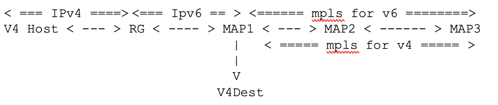

## What is MAP-T ?
MAP-T is stateless translation of IP address to solve the address depletion of IPv4 address in the network. Since this method is a stateless translation method, the performance is better than devices maintaining state (eg: CGNAT). This is a bookended solution, meaning MAP-T CE function is needed on the CPE (RGs). The border router helps in translating IPv6 address to IPv4 address and vice versa. The CPE would perform NAT44 based on port range assigned by the MAP rules. These rules are distributed by DHCP from the operator. By having this Ipv4 networks can talk to each other over an IPv6 network. The CPE device creates the IPv4 embedded IPv6 address and sent over the operator network. The border relay then helps in converting the IPv6 address back to Ipv4 which can further talk to public IPv4 network. 

### MAP-T architecture as represented in RFC 7599
```
      User N
       Private IPv4
      |  Network
      |
   O--+---------------O
   |  | MAP-T CE      |
   | +-----+--------+ |
   | NAPT44|  MAP-T | |
   | +-----+        | +-._   ,-------.                     .------.
   |       +--------+ |   ,-'         `-.                ,-'       `-.
   O------------------O  /              \   O---------O /   Public   \
                         /   IPv6-only   \  |  MAP-T  |/     IPv4     \
                        (    Network      --+  Border +-   Network     )
                         \               /  |  Relay  |\              /
   O------------------O  \              /   O---------O \             /
   |    MAP-T CE      |   ;".         ,-'                `-.       ,-'
   | +-----+--------+ | ,"   `----+--'                      ------'
   | NAPT44|  MAP-T | |,          |
   | +-----+        | +        IPv6 node(s)
   |   |   +--------+ |  (with IPv4-embedded IPv6 address)
   O---+--------------O
       |
         User M
       Private IPv4
         Network
```

## How are the IP translated ? 

Let us take an example 

**IPv4 customer prefix:** 192.0.2.0/24
**Host address in customer prefix block:** 192.0.2.18
**Destination Internet address:** 11.11.11.11
**Destination port:** 8000
**Source Port:** 1089 

**MAPT prefix (BMR):** 3001:db8::/40
**DMR prefix:** 2001:db8:ffff::/64

*Note:* Current design is DMR prefix is based on /64. Other than /64, would not work as expected. we would need to open an enhancement request accordingly 

Let us say operator wants to serve 4096 subscribers and use MAP-T having a /24 block. The MAP-T BR allocates a /24 IPv4 prefix. Which means the 8 bits can be distributed across different customers. 
Hence, 2^8 = 256 IPv4 address can be used across all customers .

**Number of customers needed :** 4096 
**Number of IP addresses usable:** 256
Now we have **4096** customers but only **256** IP address, hence we can have **4096/256 = 16** ports per IP address 
**Ports per IP address:** 16 

*Note:* 4096 is chosen such that is is divisible by 256. If you choose higher value , remaining ports can be room for growth.

**Step1:** Find IPv4 prefix and find suffix value 
       Here prefix len is 24 bits and suffix is 8 bits with value 18 
       `18` which is decimal when converted to Hex is `12`

**Step2:** Configure EA bits len (0-48 bits configurable) 
       EA bits is IPv4 suffix + PSID 
       if EA bit len is 8, then it is same as suffix and PSID will be 0. This means all ports are allowed 
       if we need to restrict ports, then we need to have a higher value 
       let us say EA bits len is configured to 12, then PSID length would be calculated as EA bits - IPV4 suffix 

**Step3:** Calculate PSID len
        EA bits len - IPv4 suffix len
        12 - 8 = 4

Each address is divided into “16” sets of ports. Each set is assigned to a different customer. 

Hence there are 16 port sets and **65536/16 = 4096** ports per port set 

So, Port set 1: 0-4095, port set 2: 4096 -8191 … such 16 sets can be used until 65535 ports

For 16 ports we need 4 bits (2 ^ 4 = 16)  or log 16(2) = 4. These 4 bits are used for PSID. 

Now the EA would be IPv4 suffix + PSID = 8 + 4 = 12 bits of EA bits Len (can be 0 - 48 bits ) referred to as “o” 

The PSID modifier bits are EA bits Len - offset - PSID Len  

If you want to restrict ports then use offset accordingly.  Let us take an example where we want to restrict ports instead of having 4096 ports per set, let us say we will need only 16 ports , then we need to define an offset . Here we need 16 ports so 4 bits need be modifier port set bits . Then 12 (ea) - offset - 4(psid Len) = 4 . Hence choose offset as 8 

If o (ea bits Len)  + r (prefix length)  i.e. 12 + 24 = 36 which is > 32 then address sharing occurs.  
If o + r  = 32 i.e. ea bits len = 8 then one to one mapping occurs and no address sharing occurs 

**Step4:** Configure offset. This is user definable and will dictate what ports get allocated. Based on above calculation, Offset is 8 as chosen earlier

**Step5:** Find out how many bits we can mangle for ports. 
This would be EA bits - offset - PSIDlen. As discussed above, this would be 4 bits  

### Process to identify PSID 

- Consider port 1089 . This is MAP-T port. 
- Convert 1089 to binary 
    10001000001 (11 bits) 

- Add 0’s (5 bits) to MSB to make 16
    0000010001000001

    ```   
    0   1   2   3   4   5   6   7    8   9   10     11  12  13  14  15   
    +----------------------------+-------------------+---------------+
    |   offset bits              |  PSID len         | modifier bits |
    +----------------------------+-------------------+---------------+
    0   0   0   0   0   1   0   0    0    1    0    0    0   0   0   1
    ```

Here PSID value is 4 and modifier bits are 4 bits so 0 - 15 ports for each port set 
To make the above representation easier 

- Remove 8 offset bits from MSB (offset defined as 8 )
    01000001

- Because PSID Len = 4 bits, create a demarcation 

    0100 (psid)- 0001(port set) 
    So PSID = 4 and ports are 0 - 15 

    Since PSID bits are set to `0   1   0   0`  hence would be `4`. In other cases for variable PSID lengths, we would need to convert binary back to hex to represent in the source IP

### What would the source IP be ?

#### Format specification 
```
    |        32 bits           |         |    16 bits        |
    +--------------------------+         +-------------------+
    | IPv4 destination address |         |  IPv4 dest port   |
    +--------------------------+         +-------------------+
                    :          :           ___/       :
                    | p bits   |          /  q bits   :
                    +----------+         +------------+
                    |IPv4  sufx|         |Port-Set ID |
                    +----------+         +------------+
                    \          /  _______/    ________/
                     \        / _/ __________/
                      \      : /  /
 |     n bits         |  o bits   | s bits  |   128-n-o-s bits      |
 +--------------------+-----------+---------+------------+----------+
 |  Rule IPv6 prefix  |  EA bits  |subnet ID|     interface ID      |
 +--------------------+-----------+---------+-----------------------+
 |<---  End-user IPv6 prefix  --->|
```

#### RFC7599 and RFC7597 representation of interface identifier
```

 | 16 bits|    32 bits     | 16 bits|
 +--------+----------------+--------+
 |   0    |  IPv4 address  |  PSID  |
 +--------+----------------+--------+
```

#### Final translated source IP 
For source IP 
3001:db8: 00 (40 bits )
12(suffix):4 (psid) (12 bits) 
0s (12 bits) 
C000:0212:04 (IPv4 + PSID) 
Final source address 3001:db8:0012:400:c000:0212:04 

```
                                                             <---- IPv4 ------------->
3001:db8:       00          12          :4     00:          c0      00:      02     12:      04
    |           |           |            |      |           |       |         |     |         |
    v           v           v            v      v           v       v         v     v         v
        
BMR prefix  8 bits of 0     IPv4        PSID    reserved    192     0        2      18      PSID
                            suffix              0's
```

### What would the destination IP be ? 

#### Format specification
```
<---------- 64 ------------>< 8 ><----- 32 -----><--- 24 --->
+--------------------------+----+---------------+-----------+
|        BR prefix         | u  | IPv4 address  |     0     |
+--------------------------+----+---------------+-----------+
```
Destion IPv4 address is 11.11.11.11
in Hexadecimal `11` would be `b` 

Destination port is 8000
`8000` in binary is `1111101000000` (13 digits)

#### Final translated Destination address 

```
2001:db8:ffff: 0 :   0       b      :0b0b      :0b   00:0 
    |          |     |       |       |           |   |  |
    v          v     v       v       v           v   v  v
 DMR prefix    0s   8bits    11     11.11       11   0  0
                    of 0s
```

If no offset is defined, then we allow until 

PSID - Port set IDs
0000 - 010001000001

```   
0   1   2   3   4   5   6   7    8   9   10     11  12  13  14  15   
+----------------------------+-------------------+---------------+
| PSID len  |               modifier bits                        |
+----------------------------+-------------------+---------------+
0   0   0   0   0   1   0   0    0    1    0    0    0   0   0   1
```
PSID = 0 - 15
So ports can be between 000000000000 - 111111111111 ( 0-4095) Hence all ports are allowed and no port restrictions are done on this.  

## Simulating MAP-T CE device on a ubuntu VM
RGs which support MAP-T CE function is supported by openWRT or other vendor RGs. In order to simulate on linux, we can leverage the old kernel development done by CERNET. You can find more information [here](https://github.com/cernet/MAP)

### Bring up ubuntu VM
Since this is an old package, it is better to use an older version. Here I used ubuntu 14.04 version. 
To bring up ubuntu VM, you can use the [topology-builder](https://github.com/ARD92/vm-topology-builder)
Once the VM is up, follow the below steps. 

### Install kernel changes
```
sudo apt-get install libncurses-dev flex bison openssl libssl-dev dkms libelf-dev libudev-dev libpci-dev libiberty-dev autoconf
```

### Clone package
```
git clone https://github.com/cernet/MAP.git
```
### Building kernel module
```
apt-get install make

cd modules
make

cd ../utils
make 
```
at the end of these steps there would be an executable `ivctl` which would be used to configure the ubuntu VM to behave as an RG

### Install module 
under the cloned repo root directory, there will be a shell script by named `control`. This is used to install the module. Under the hood it calls `insmod`.

To install the compiled kernel module use
```
./control start
```

### Validate the usage
```
root@ubuntu:~/patch/MAP# lsmod | grep ivi
ivi                    44468  0
```

## Usage 

## Create the rule mapping 

 utils/ivictl -r -d -P 2001:fc80:3721:ffff::/64 -T

## Create and start map

utils/ivictl -s -i def-rg -I eth1 -H -a 192.168.1.0/24 -P 2001:fc80:3721::/48 -z 6 -R 16 -o 0 -c 1518 -T

-z is PSID offset 
-R is number of customers share the IP 
-C is MTU 

## Topology considered 



Here the RG and host are simulted on ubuntu VM. map1 is PE and map3 is the BR node performing the translations. 

## Create Host using network namespaces

## MX Border relay configuration 

### Define chassis config
```
set chassis fpc 0 pic 0 tunnel-services bandwidth 1g
set chassis fpc 0 pic 0 inline-services bandwidth 1g
```

### Define MAP-T domain
```
set services softwire softwire-concentrator map-t mapt-domain-1 dmr-prefix 2001:fc80:3721:ffff::/64
set services softwire softwire-concentrator map-t mapt-domain-1 ipv4-prefix 172.168.1.0/24
set services softwire softwire-concentrator map-t mapt-domain-1 mapt-prefix 1111:2222::/32
set services softwire softwire-concentrator map-t mapt-domain-1 ea-bits-len 8
set services softwire softwire-concentrator map-t mapt-domain-1 psid-offset 4
set services softwire softwire-concentrator map-t mapt-domain-1 psid-length 0
set services softwire softwire-concentrator map-t mapt-domain-1 mtu-v6 9192
```

### Create rules to map to map-t domain
```
set services softwire rule r1 match-direction input
set services softwire rule r1 term t1 then map-t mapt-domain-1
```

### Map rule to rule set
```
set services softwire rule-set rset1 rule r1
```
### Map rule to service set
```
set services service-set mapt_set1 softwire-rule-sets rset1
set services service-set mapt_set1 next-hop-service inside-service-interface si-0/0/0.1
set services service-set mapt_set1 next-hop-service outside-service-interface si-0/0/0.2
```

### create service domains
```
set interfaces si-0/0/0 unit 1 family inet
set interfaces si-0/0/0 unit 1 family inet6
set interfaces si-0/0/0 unit 1 service-domain inside
set interfaces si-0/0/0 unit 2 family inet
set interfaces si-0/0/0 unit 2 family inet6
set interfaces si-0/0/0 unit 2 service-domain outside
```
## Captures
```
root@map3# run show services inline softwire statistics mapt

 Service PIC Name                                    si-0/0/0

 Control Plane Statistics
     MAPT ICMPv6 translated to ICMPv4                   10202
     MAPT ICMPv4 translated to ICMPv6                   0
     MAPT ICMPv4 discards                               0
     MAPT ICMPv6 discards                               0

 Data Plane Statistics (v6-to-v4)      Packets                 Bytes
     MAPT v6 translated to v4           15                      1200
     MAPT v6 spoof drops                0                       0
     MAPT v6 fragment drops             0                       0
     MAPT v6 unsupported drops          0                       0

 Data Plane Statistics (v4-to-v6)      Packets                 Bytes
     MAPT v4 translated to v6           30                      2520
     MAPT v6 MTU exceed drops           0                       0
     MAPT v4 fragment drops             0                       0
     MAPT v4 unsupported drops          0                       0


root@map3# run show route table inet6.0

inet6.0: 5 destinations, 5 routes (5 active, 0 holddown, 0 hidden)
+ = Active Route, - = Last Active, * = Both

2001:fc80:3721:ffff::/64
                   *[Static/524289] 1w2d 23:48:15
                    >  via si-0/0/0.1

root@map3# run show route table inet.0

inet.0: 12 destinations, 12 routes (12 active, 0 holddown, 0 hidden)
+ = Active Route, - = Last Active, * = Both

172.168.1.0/24     *[Static/524290] 1w2d 23:48:47
                    >  via si-0/0/0.2
```

# References
- [https://www.jool.mx/en/map-t.html](https://www.jool.mx/en/map-t.html)
- [https://www.lacnic.net/innovaportal/file/5220/1/map-t-lacnic.pdf](https://www.lacnic.net/innovaportal/file/5220/1/map-t-lacnic.pdf)
- [rfc7599](https://datatracker.ietf.org/doc/html/rfc7599)
